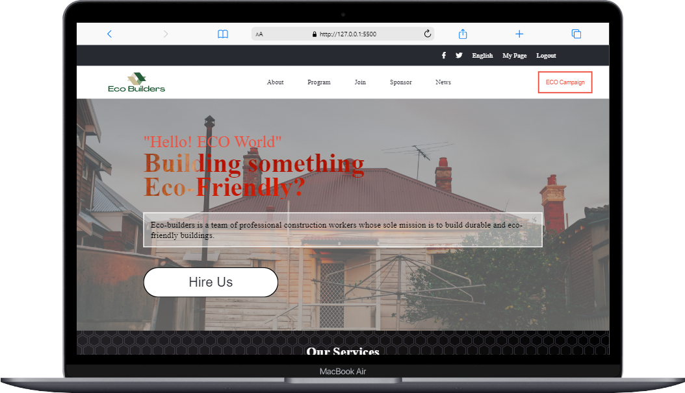
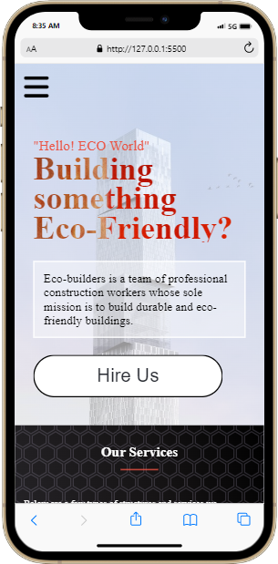

# ECO BUILDERS

> Building a construction landing page for a company that builds durable and eco-friendly buildings.

## Built With

- Html
- Javascript
- CSS 
- Behance

## Live Demo

[ECO BUILDERS](https://nahnahaj.github.io/construction-page/)

> 
> 

## Getting Started

To get a local copy up and running follow these simple example steps.

### Prerequisites

- Have a Desktop or Laptop Computer running on with Windows, Mac OS or Linux operating system.
- Have git installed on the Computer
- Have a browser install on the Computer

### Setup

- If it suits you, on your local computer, create a directory in your preferred location (e.g in the Desktop or Document directory)

### Install

- Open your Terminal/Powershell or any command line interface you use, then navigate to your created above directory or the directory you'll like to clone this project directory.
- Type `git clone https://github.com/NahnahAJ/construction-page.git` if your're using https with git or `git clone git@github.com:NahnahAJ/construction-page.git` if your preferred is ssh and hit enter.
- Navigate to the `construction-page` directory on your local computer in your above chosen directory and open the `index.html` file.

### Usage

- You can view the HTML document in your preferred or default browser.

## Author

👤 **Nahnah Ahjuwah**

- GitHub: [@githubhandle](https://github.com/NahnahAJ)
- Twitter: [@twitterhandle](https://https://twitter.com/NahnahAhjuwah)
- LinkedIn: [LinkedIn](https://www.linkedin.com/in/felicia-awuah-0674a7152/)

## 🤝 Contributing

Contributions, issues, and feature requests are welcome!

Feel free to check the [issues page](../../issues/).

## Show your support

Give a ⭐️ if you like this project!

## Acknowledgments

- Original design idea by [Cindy Shin in Behance.](https://www.behance.net/adagio07)

## 📝 License

This project is [MIT](./LICENSE) licensed.

